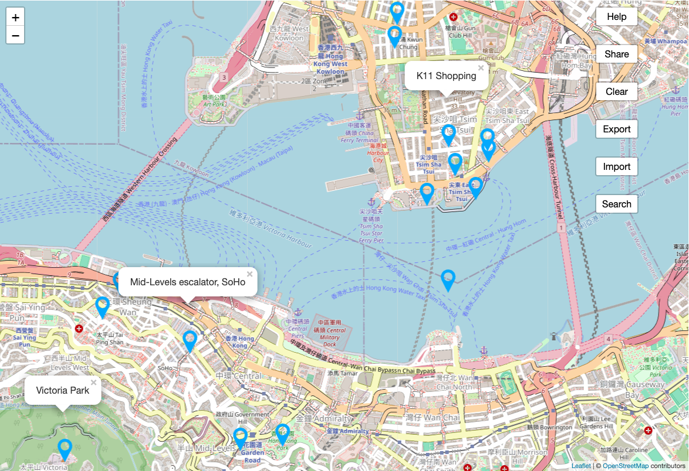

# WeeMap: A Collaborative and Interactive Mapping Tool

This is a map where you can add markers to remember and share locations.

## Examples
- You can use the online application at https://weemap.org
- Example map of  
  [Hong Kong attractions inside one URL like https://weemap.org/#<lat,lng,comment>;..](https://weemap.org/#22.283611,114.154722,Mid-Levels%20escalator%2C%20SoHo;22.297333,114.1765,K11%20Shopping;22.3875,114.184722,Ten%20Thousand%20Buddhas%20Monastery;22.30589,114.16987,Temple%20Street%20Night%20Market;22.331944,114.190556,Kowloon%20Walled%20City%20Park%20%2B%20Museum;22.287753,114.173619,Star%20Ferry;22.339109,114.204526,sch%C3%B6ner%20Gartenpark;22.277286,114.1615,Sch%C3%B6ner%20Park%202.0;22.287601,114.149632,Hotel;22.248652,114.174384,Ocean%20Park%2C%20Ocean%20Park%20Road%2C%20Wong%20Chuk%20Hang%20San%20Wai%2C%20Southern%20District%2C%20Hong%20Kong%20Island%2C%20Hongkong%2C%20China;22.284763,114.212367,Monster%20Building;22.293605,114.172063,Space%20Museum;22.296566,114.176576,Wing%20On%20Plaza;22.33586,114.163888,Garden%20Hill;22.333792,114.163494,Mei%20Ho%20Hostel%20Museum;22.329757,114.160851,Sham%20Shui%20Po;22.304272,114.169701,Temple%20Street%20Night%20Market;22.297602,114.173645,K11%20Shopping;22.294023,114.175647,Avenue%20of%20Stars%20Light%20Show%208pm;22.276255,114.1456,Victoria%20Park;22.277009,114.158442,I%20recomment%20arriving%20early;22.285924,114.148319,Possession%20Street)  
  (you would share such a link to friends or family members on a trip)  

## How to run this:
- To run a local copy, clone the repository and open `index.html`.
- This application does not require a make process and also no server.

## Functions: 
- Click on the map to add a location (blue marker). 
- Right-click on a marker to remove it. 
- Click on a marker to show its comment. 
- Click on the comment to edit it. 

All markers are stored in the URL of the page! 
This means there are no accounts or logins required. 

## You can share the URL with others to collaborate with the markers: 
- Copy the URL with the "Share" button. 
- Export all markers with the "Export" button into a text file. 
- Import markers with the "Import" button. The import format is identical to the export format, but you can also import other WeeMap URLs. 

## You can also search for locations: 
- Click on the "Search" button and enter a location name. 
- Results are only searched within the visible view box! 
- Click on a search result location (green marker) to view the location name. 
- To convert a search result marker (green) into a normal, stored marker (blue), right-click on it. 

## FAQ: 
- Does weemap.org store any of the location data?  
  No, all data is only stored in the URL of the page on your own device. 
- Does weemap.org store any cookies or personal data?  
  No, weemap.org operates without cookies. You do not need to have an account to use weemap.org so we do not have any personal data from you. 
- How many locations can be stored in the URL?  
  About 40
- Does the import function recognize and ignore duplicates?  
  Yes, locations are matched using a similarity metric on the coordinates to avoid duplicates.
- Can I use the map offline?  
  Yes, if you have visited the map before. All visited tiles are cached in the browser. 
- Is this open source? Where can I get the source code?  
  Yes, the source code is available on GitHub: https://github.com/orbiter/weemap
- Can I contribute or help?  
  Pull requests are welcome. To support development subscribe to https://www.patreon.com/orbiterlab

Have fun!